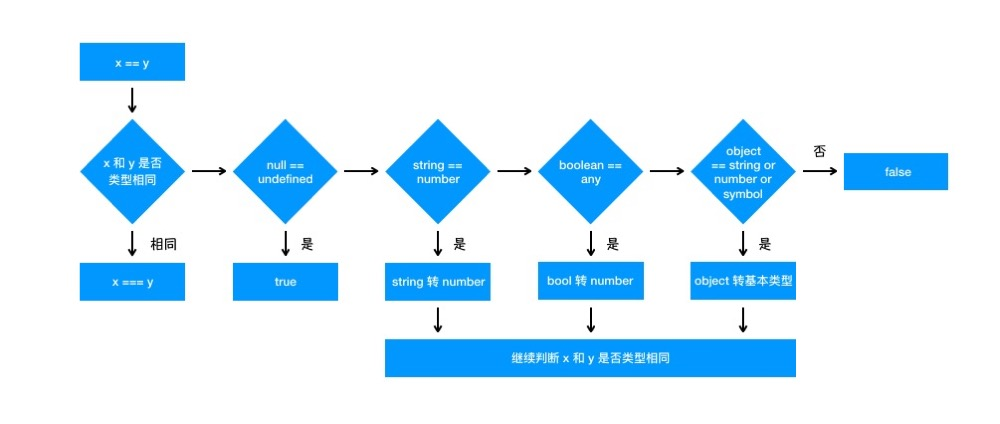

### What are the type coercion rules when using the equality (==) operator？

The equality operators (== and !=) provide the IsLooselyEqual semantic.

For the equality operator, if the types of the two operands being compared are different, the type conversion is performed. If you compare whether x and y are the same, the following judgment process will be performed:

First, it will determine whether the two types are the same, and compare the size of the two if they are the same;

Second, if the types are not the same, type conversion will be performed;

Third, it will first determine whether it is comparing null and undefined, and if it is, it will return true;

Forth, Check if the types of both are string and number, if so, the string will be converted to number.

Fifth, to determine whether one of the parties is a boolean, if so, it will change the boolean to number and then make a judgment.

Sixth, Determine if one of the elements is an object and the other is a string, number, or symbol. If so, the object will be converted to its primitive type before the comparison.

In sumary, while a double equal sign(==) performs type coercion, the strict equality operator (===) does not. With a triple equal sign(===), both the value and the type must be the same for the comparison to be true. It is generally recommended to use strict equality operator (===) to avoid unexpected type coercion behavior.

