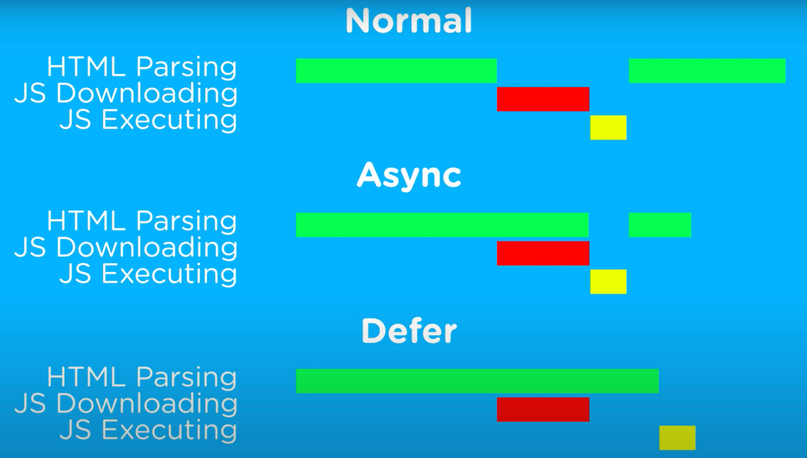

### What are the methods for delaying the loading of JavaScript scripts? 

Delayed loading is to wait until the page is loaded before loading JavaScript file. js delayed loading helps to speed up page loading. 

Generally, there are the following methods: 

1）the Defer Attribute

Add the defer attribute to the js script. This attribute synchronizes the script loading and Document parsing, and then executes the script file after the document parsing is completed. In this way, the page rendering is not blocked. Multiple scripts with the preceding attribute are executed sequentially according to the specifications, but this may not be the case in some browsers.

2）the Async Attribute

Add the async attribute to the js script. This attribute will asynchronously load the script and will not block the parsing process of the page. However, when the script is loaded, the js script will be executed immediately. If the document is not parsed, it will also be blocked. The execution sequence of scripts with multiple async attributes is unpredictable and is generally not executed in sequence according to the code sequence. 

3）Dynamic DOM Creation

To dynamically create DOM tags, you can listen to document loading events. After the document is loaded, you can dynamically create script tags to introduce js scripts. 

4）SetTimeout

Set a timer to delay loading js script files 

5）Let JS Finally Load

Put the js script at the bottom of the document so that the js script can be loaded and executed at the end as much as possible. 

