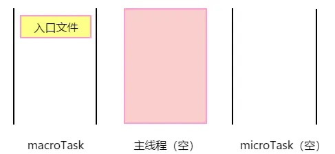
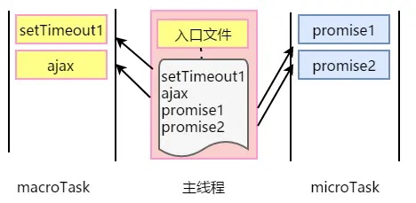
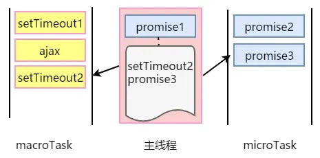
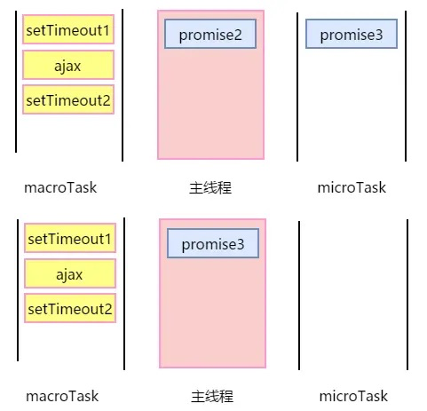
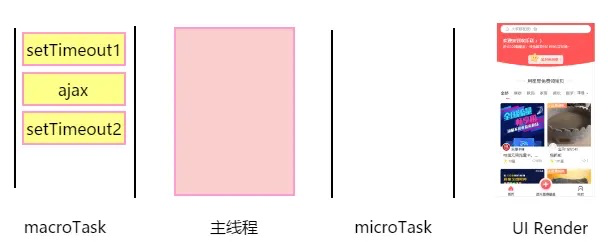

### Qestion
每一轮 Event Loop 都会伴随着渲染吗？

requestAnimationFrame 在哪个阶段执行，在渲染前还是后？在 microTask 的前还是后？

requestIdleCallback 在哪个阶段执行？如何去执行？在渲染前还是后？在 microTask 的前还是后？

resize、scroll 这些事件是何时去派发的。

### Answer
事件循环不一定每轮都伴随着重渲染，但是如果有微任务，一定会伴随着微任务执行。

决定浏览器视图是否渲染的因素很多，浏览器是非常聪明的。

requestAnimationFrame在microTask全部执行后，重新渲染屏幕之前执行，非常适合用来做动画。

requestIdleCallback在渲染屏幕之后执行，并且是否有空执行要看浏览器的调度，如果你一定要它在某个时间内执行，需要使用 timeout 参数。

resize和scroll事件其实自带节流，它只在 Event Loop 的渲染阶段去派发事件到 EventTarget 上。








实战题目：

```
async function async1() {
  console.log("async1 start");
  await async2();
  console.log("async1 end");
}

async function async2() {
  console.log("async2");
}

console.log("script start");

setTimeout(function () {
  console.log("setTimeout");
}, 0);

async1();

new Promise(function (resolve) {
  console.log("promise1");
  resolve();
}).then(function () {
  console.log("promise2");
});
console.log('script end');
```

在 `await async2()` 那儿卡住了，搜了下等价于:

```
Promise.resolve(async2()).then(() => {
    console.log('async1 end')
  })
```
所以 async2() 会先执行

```
// 执行结果
script start
async1 start
async2
promise1
script end
async1 end
promise2
setTimeout
```
